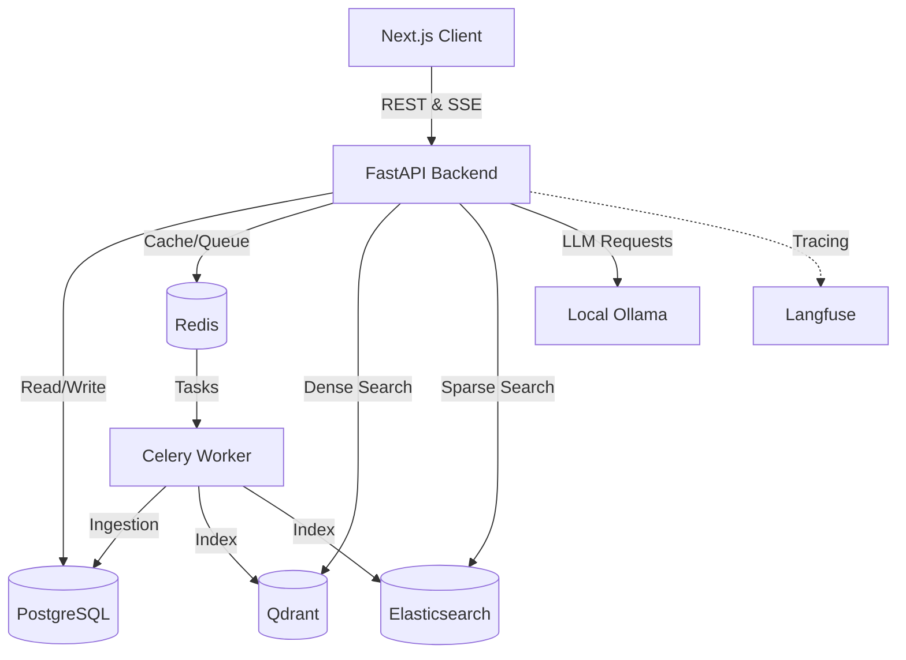
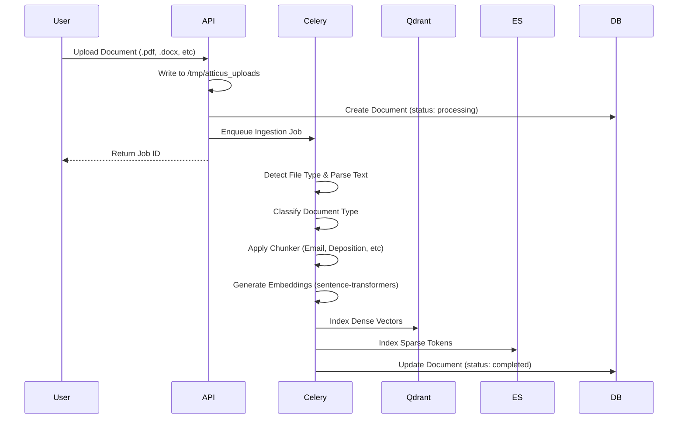
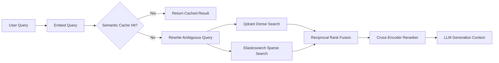

# Architecture & Technical Details

Last updated: 2026-06-14

This document serves as the technical companion to the [README.md](../README.md), focusing on system design, data flow, and core implementation details of the Atticus platform.

## System Architecture

Atticus is built on a modern, decoupled architecture separating the client, API backend, and asynchronous workers.

## Security & Access Model

- **App Roles**: `admin`, `lawyer`
- **Access Model**: Multi-tenant-like isolation at the case level. Both role checks and case assignment checks (`assigned_lawyers`) are strictly enforced.

## Document Ingestion Pipeline

The ingestion process is completely asynchronous, relying on Celery to handle computationally expensive tasks like parsing, chunking, and embedding.

### Chunking Strategies
We use specialized chunkers to handle the unique structure of different legal documents:
- `EmailChunker`: Preserves metadata (From, To, Date) alongside email body.
- `DepositionChunker`: Preserves Q&A cadence and speaker boundaries.
- `SectionedChunker`: Ideal for formal briefs with clear headings.
- `NarrativeChunker`: Optimized for continuous prose and reports.
- `UnstructuredChunker`: Fallback chunker for raw text files.

## Hybrid Retrieval Pipeline

To ensure the highest accuracy for legal queries, Atticus uses a two-stage hybrid retrieval system combining semantic understanding with exact keyword matching.

## Data Model

**Core Tables:**
- `users`: Authentication and role data.
- `cases`: The root boundary for document isolation.
- `documents`: Metadata and sync status for uploaded files.
- `ingestion_jobs`: Granular state tracking of the ingestion worker.
- `conversations` & `messages`: Chat history tracking.

**Database Migrations:**
Handled via plain SQL migrations applied sequentially on startup (`backend/scripts/apply_migrations.py`).

## Core API Map

- **Auth**: `/auth/register`, `/auth/login`, `/auth/logout`, `/auth/me`
- **Cases**: `/cases`, `/cases/{case_id}`, `/cases/lawyers`, `/cases/demo/reset`
- **Documents**: `/cases/{case_id}/documents/*`
- **Ingestion**: `/ingestion/jobs`, `/ingestion/jobs/{file_id}`
- **Chat**: `/chat`, `/chat/stream`, `/chat/conversations/*`
- **Health**: `/health`, `/ready`

## Operations & Scripts

To manipulate data locally or in demo environments:

- `backend/scripts/reset_demo_data.py`: Clears existing demo objects.
- `backend/scripts/seed_demo_data.py`: Seeds the system with the Finch Demo Matter.
- `backend/scripts/reset_and_seed_demo_data.py`: Combined orchestration script.
